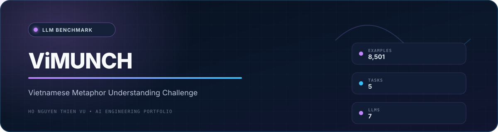
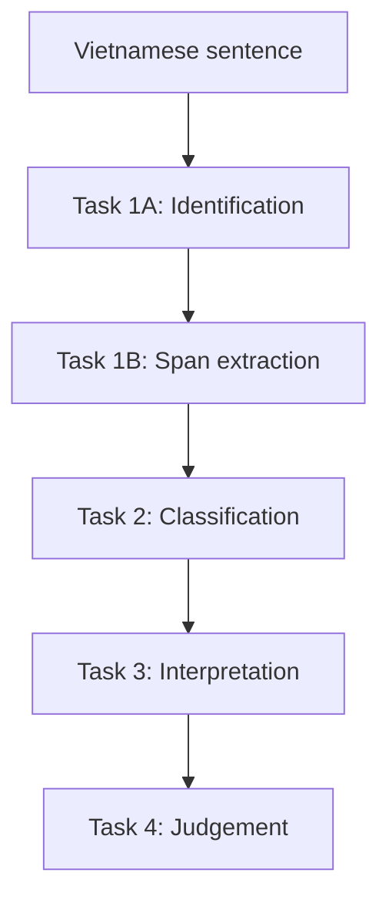

<div align="center">
  
  <br /><br />

  
  
  
  
  
</div>

## Overview

**ViMUNCH** - the Vietnamese Metaphor Understanding Challenge - is a multitask benchmark for evaluating how large language models identify, locate, classify, interpret, and judge Vietnamese metaphors.

The project focuses on Vietnamese linguistic and cultural characteristics, testing whether models can reason about cross-domain mappings rather than rely only on surface lexical similarity.

<div align="center">
  <a href="https://drive.google.com/file/d/1gigNjL6QLCnHk2Gd94whlp35hqMw4NIW/view?usp=drive_link">
    
  </a>
</div>

## Dataset Card

| Examples | Train | Development | Test | Metaphor types |
|---:|---:|---:|---:|---:|
| **8,501** | **5,950** | **850** | **1,701** | **5** |

| Property | Description |
|---|---|
| **Language** | Vietnamese |
| **Source** | Van Nghe Newspaper - Vietnam Writers' Association |
| **Genres** | Poetry, prose, journalism, and other figurative-rich writing |
| **Format** | JSON files for training and evaluation |
| **Scope** | Multitask metaphor understanding and LLM evaluation |

## Evaluation Tasks



| Task | Objective | Output |
|---|---|---|
| **1A - Identification** | Determine whether the sentence contains a metaphor | Binary decision |
| **1B - Span Extraction** | Locate the metaphorical phrase | Start and end boundaries |
| **2 - Classification** | Assign metaphor categories | One or more of five types |
| **3 - Interpretation** | Restate the metaphorical sentence literally | Natural-language interpretation |
| **4 - Judgement** | Evaluate an interpretation using a rubric | Accuracy, clarity, and naturalness score |

## Metaphor Taxonomy

1. **Structural metaphor**
2. **Orientational metaphor**
3. **Ontological metaphor**
4. **Emotional metaphor**
5. **Folklore metaphor**

The taxonomy is informed by Lakoff and Johnson, with additions adapted to Vietnamese characteristics.

## Experimental Snapshot

| Setting | Scope |
|---|---|
| Models | Seven LLMs in the approximately 7-8B parameter range |
| Evaluation | Zero-shot, few-shot, and fine-tuning |
| Fine-tuning | Supervised fine-tuning with LoRA |
| Leading reported result | Vistral-7B-Chat reached approximately **0.772 F1** on identification after fine-tuning |

The reported experiments indicate that fine-tuning reduced false positives and improved adherence to the evaluation rubric. Results should be interpreted within the published data, split, prompts, and experiment configuration.

## Repository Map

| Path | Purpose |
|---|---|
| `Dataset/` | Train, development, and test data |
| `Report/` | Thesis report and presentation materials |
| `Source/Annotation tool/` | Django-based annotation workflow |
| `Source/Demo application/` | Streamlit demonstration application |
| `Source/Experiments with LLMs/` | Prompting and fine-tuning experiments |

## Run the Annotation Tool

### 1. Create the environment

```bash
cd "Source/Annotation tool"
python -m venv .venv
pip install -r requirements.txt
```

### 2. Configure local credentials

Never commit real credentials. Set environment variables before running Django:

```bash
export DJANGO_SECRET_KEY="replace-with-a-new-random-secret"
export DJANGO_DEBUG="True"
export DB_NAME="ViMUNCH_annotation"
export DB_USER="root"
export DB_PASSWORD="your-local-password"
export DB_HOST="localhost"
export DB_PORT="3306"
```

On Windows PowerShell, use `$env:VARIABLE_NAME="value"` instead of `export`.

Generate a Django key with:

```bash
python -c "from django.core.management.utils import get_random_secret_key; print(get_random_secret_key())"
```

### 3. Initialize and start

```bash
python manage.py migrate
python manage.py runserver
```

> [!IMPORTANT]
> Credentials previously committed to Git history must be rotated. Removing them from the current source does not invalidate exposed credentials or erase them from earlier commits.

## Intended Use and Limitations

- Intended for academic research, model evaluation, and Vietnamese NLP benchmarking.
- Source text may be subject to third-party rights; review provenance and applicable terms before redistribution or commercial use.
- Model scores depend on prompts, decoding, fine-tuning configuration, and evaluation implementation.
- Automated interpretations and judgements may contain linguistic or cultural errors.
- No explicit repository license currently grants unrestricted reuse; do not assume redistribution rights.

## Team

**Authors:** Ho Nguyen Thien Vu, Nguyen Phi Long  
**Supervisor:** Dr. Nguyen Van Kiet

For research-use or citation questions, contact the maintainers through GitHub.
